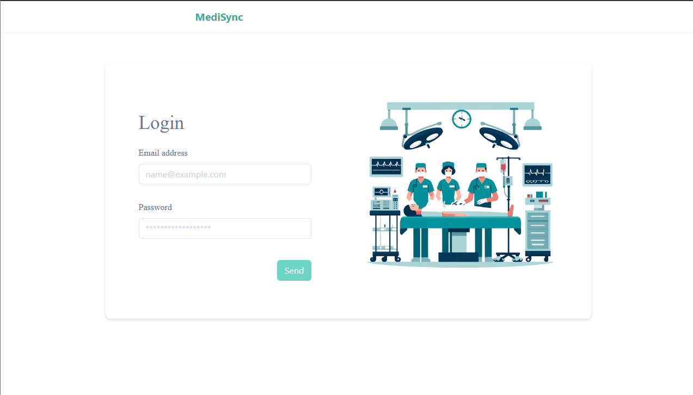
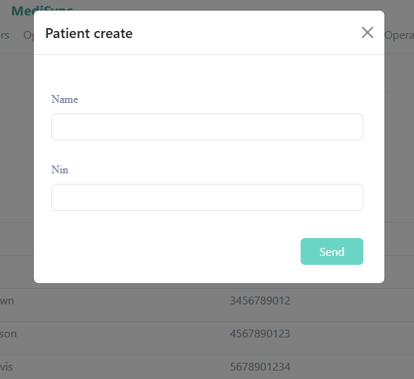
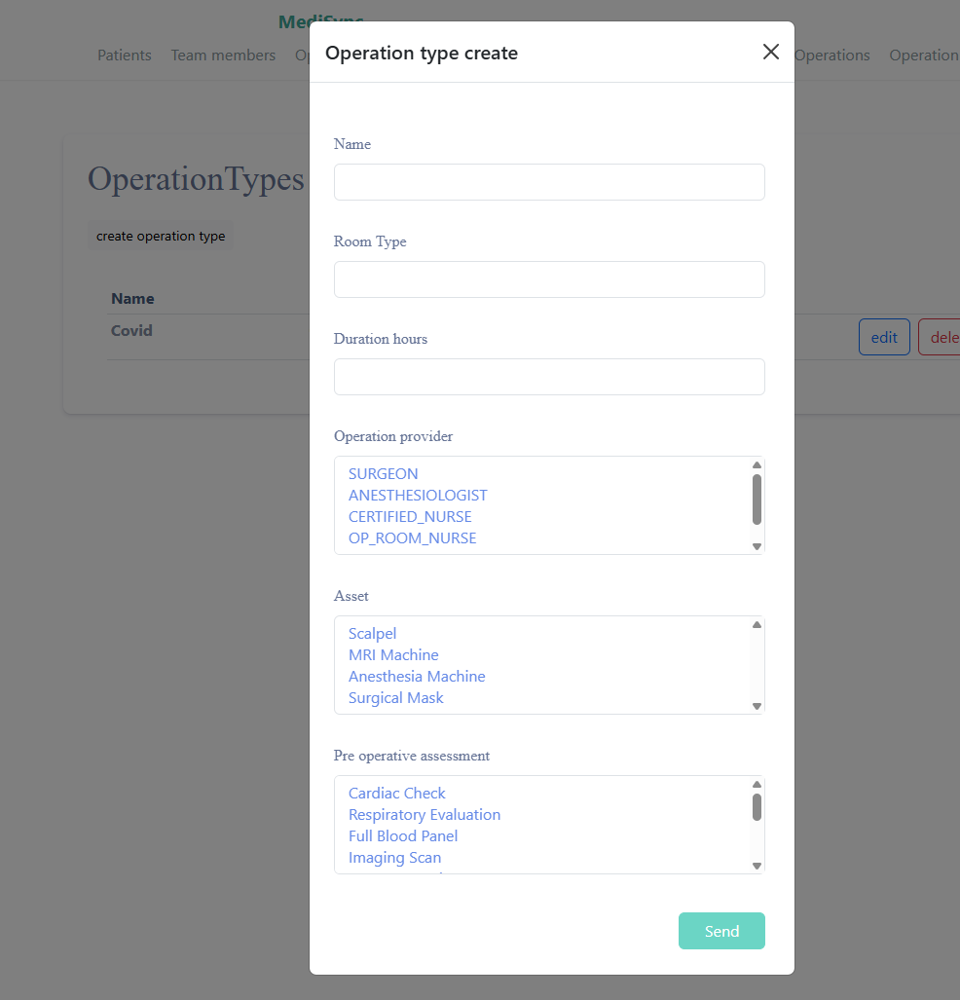
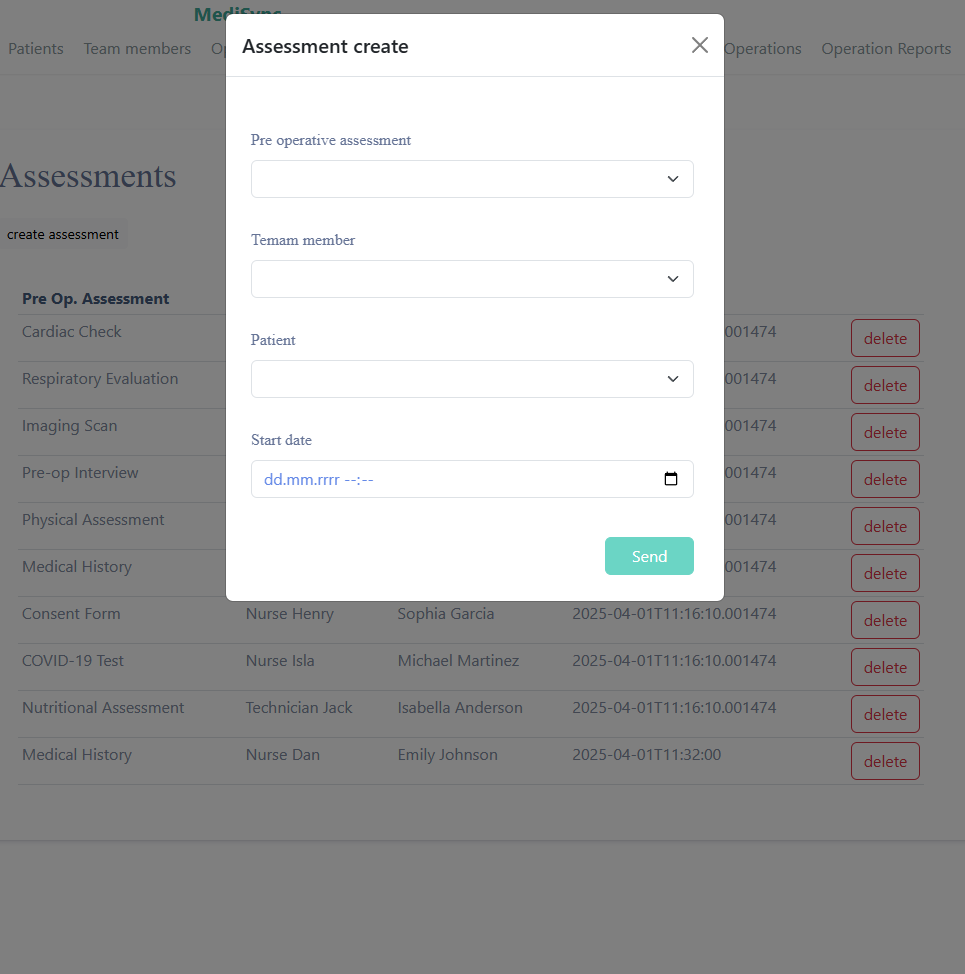
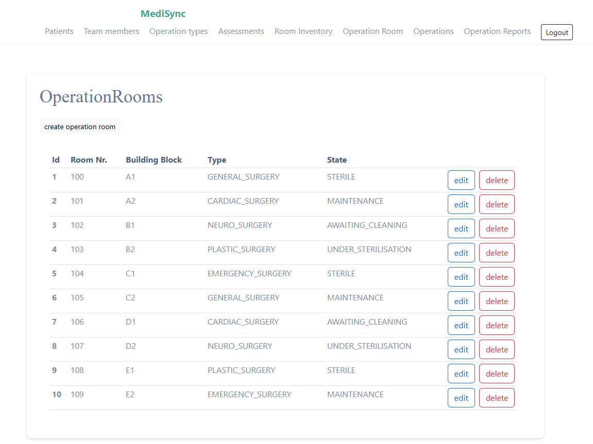
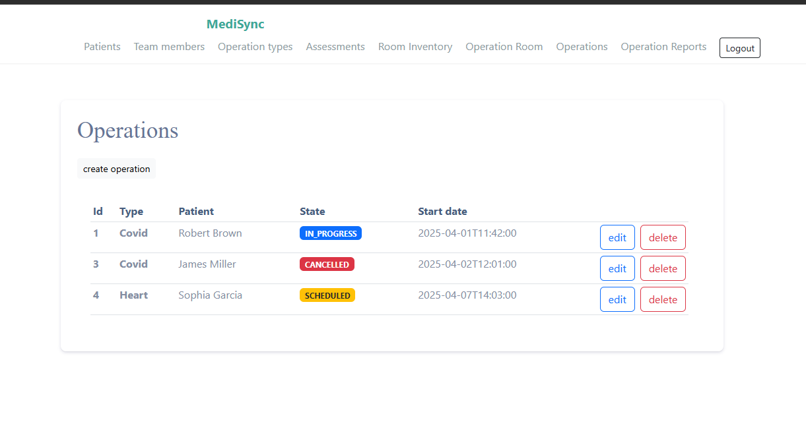
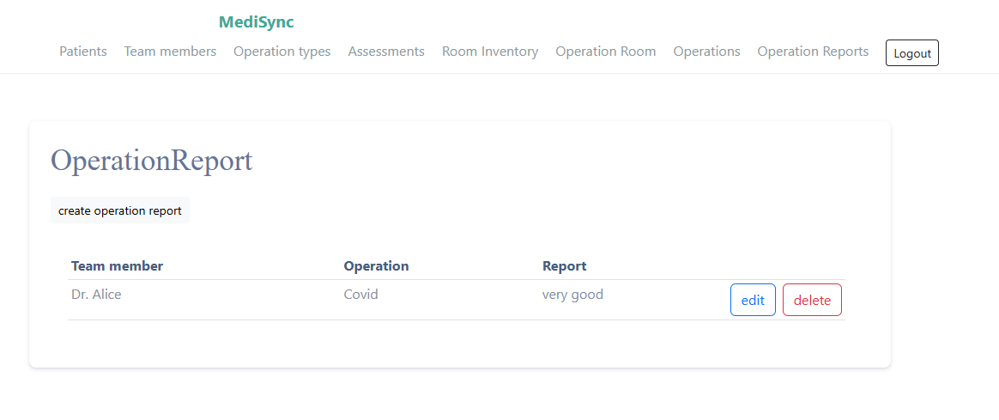

# MediSync-frontend

MediSync-frontend to aplikacja webowa służąca do zarządzania danymi medycznymi, stanowiąca interfejs użytkownika systemu MediSync. Została zaprojektowana w technologii Angular, z naciskiem na przejrzystość, użyteczność i bezpieczeństwo. Współpracuje z backendem systemu, umożliwiając interakcję z danymi dotyczącymi pacjentów, operacji, zespołów medycznych oraz ocen przedoperacyjnych.

## Spis treści

- [Opis projektu](#opis-projektu)
- [Funkcjonalności](#funkcjonalności)
- [Technologie](#technologie)
- [Instalacja](#instalacja)
- [Obsługa autoryzacji](#obsługa-autoryzacji)
- [Przykłady ekranów](#przykłady-ekranów)

---

## Opis projektu

Frontend systemu MediSync jest interfejsem użytkownika umożliwiającym:

- Zarządzanie pacjentami
- Dodawanie operacji i zespołów
- Obsługę sal operacyjnych oraz zasobów
- Dodawanie ocen przedoperacyjnych i medycznych
- Logowanie i autoryzację użytkowników (JWT)

## Funkcjonalności

### 🩺 Pacjenci

- Przegląd, dodawanie, edycja i usuwanie pacjentów

### 🧠 Oceny przedoperacyjne i operacyjne

- Możliwość rejestracji oceny stanu zdrowia pacjenta przed operacją
- Powiązanie oceny z zespołem medycznym i pacjentem

### 🏥 Sale operacyjne

- Przegląd dostępnych sal
- Powiązanie zasobów z salami

### 👨‍⚕️ Zespół medyczny

- Lista lekarzy i personelu (SURGEON, ANESTHESIOLOGIST itd.)
- Powiązanie z konkretnymi operacjami

### 🔐 Uwierzytelnianie

- Logowanie z JWT
- Ochrona tras (routing + AuthGuard)
- Automatyczne odświeżanie danych

---

## Technologie

- **Angular 19.2.5**
- **RxJS** – zarządzanie danymi asynchronicznymi
- **Bootstrap 5** – stylizacja UI
- **JWT Auth** – uwierzytelnianie
- **Reactive Forms** – formularze walidowane dynamicznie
- **HttpClientModule** – komunikacja z REST API backendu
- **LocalStorage** – przechowywanie tokenu
---

## Instalacja

1. Sklonuj repozytorium:

   ```bash
   git clone https://github.com/Radson29/MediSync-frontend.git
   cd MediSync-frontend
   ```

2. Zainstaluj zależności:

   ```bash
   npm install
   ```

3. Uruchom aplikację:

   ```bash
   ng serve
   ```

4. Domyślnie aplikacja będzie działać na `http://localhost:4200`

---

## Obsługa autoryzacji

- Logowanie odbywa się poprzez wysłanie danych do backendu (`/api/auth/login`)
- Token JWT zapisywany jest w `localStorage`
- Token automatycznie dołączany do zapytań przez `JWTInterceptor`
- Dostęp do tras zabezpieczony przez `AuthGuard`:

---

## Przykłady ekranów









---


## Licencja

Projekt open-source do celów edukacyjnych i demonstracyjnych.
